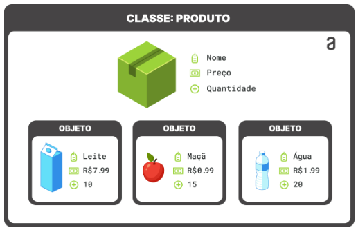

## Comandos

- verificar versão do python
  - python3 --version

- install pip
  - sudo apt install python3-pip -y

- Autalizando o pip 
  - sudo -H pip3 install --upgrade pip

- PIP – Instalar pacotes Python
  - pip3 install (nome_do_pacote)

___________________________________________________________________________________________________ 

## Lógica de Programação com Orientação a Objetos
 
- Programação estruturada vs. Programação Orientada a Objetos 
  - programação estruturada
      - É quando temos uma função principal e podemos criar dentro
    desta várias funções e procedimentos, como por exemplo: algumas
    estruturas de repetições, funções para somar valores e ai por diante
    
  - Conhecendo a estrutura da programação orientada a objetos
    - Em uma Classe(seria o documento na programação estruturada), temos vários métodos e estes podem ser
    tanto procedimentos quanto funções
    - Dentro desta classe, existem os atributos e temos os métodos que são 
    as funções ou procedimentos como foi dito anteriomente, que existem
    dentro dessa nossa classe
    - Estes objetos, nossas classes e métodos, eles podem compartilhar
    informações dependendo da visibilidade, sendo publica ou protegida
    - Resumindo a OO: É criarmos classes, que dentro das mesmas 
    existem atríbutos e que também existem métodos.
    
  - O que é Orientação a Objetos
    - também conhecida como POO, tem o conceito de Objeto ligado
    a ela. Um conjunto de objetos representam conceitos do mundo 
    real, junto das suas características, atributos e comportamentos.
  
  - Palavras reservadas em POO
    - Classes: É o que define as características e os comportamentos do 
    mundo real
    - Objetos: É a instância de uma classe
    - Atributos: São as características que definem o objeto
    - Métodos: São os comportamentos do mundo real
    
  - Exemplo
    - Temos uma classe Animal
    
    - Atríbutos:
      - Nome
      - Idade
      - Espécie
      
    - Métodos
      - Comer
      - Dormir
___________________________________________________________________________________________________
- Objetos e Classes

  - Classe
    - É ela que representa a abstração de objetos de um mundo real
    - Dentro de uma classe que atribuímos e definimos o que nossa aplicação deve ter
    - Ela funciona como um modelo que será instanciado por um objeto

    - O que uma Classe deve ter?
      - Nome da Classe:
        - Iniciar em letra Maiúscula e caso tenha uma outra palavra unida, a mesma deve ter também 
        uma letra maiúscula.
        - Ex.: AnimaisZoologico, CadastroClientes.
      - Atributos:
        - São características que definem o objeto
        - Ex.: Nome, idade, peso, altura, data nascimento.
        - existem também a questão de visibilidade dentro dos atributos
      - Métodos:
        - São os comportamentos do mundo real
        - Ex.: Come, dorme, necessidades, caminhada.
        - métodos também consistem de uma questão de visibilidade
        
    - Ela(classe) deve ser projetada antes de ser implementada, isso pode ser feito no
    diagrama de classes.
      - diagrama de classes, mostra de forma ilustrativa, como que deve ficar o código em si
      
    - Visibilidade em geral é definido por:
      - public
      - private
      - protect
    
    - Objeto
      - É uma instância de uma classe
      - É a representação do mundo real através de códigos
      - Para o objeto ser criado, ele deve ser instanciado no código
      - A classe tem as informações necessárias para criar um objeto.
___________________________________________________________________________________________________
  - Pilares da Programação Orientada a Objetos
    - Abstração
      - Abstrair informações do que serão cadastrado, pegando os valores em comum e 
      'deixando' em uma única classe
      - Abstrair apenar o necessário para a implementação do código
    - Encapsulamento
      - Restringir partes da implementação, assim partes ficam invisíveis
    - Herança
      - Definição herdada de uma classe já existente, é passado todos os comportamentos e 
      características, porém, o comportamento e características vão depender da visibilidade
    - Polimorfismo (muitas formas)
      - Permite que um mesmo nome represente vários comportamentos diferentes.
        - Ex.: um método chamado soma, recebendo dois parâmetros e outro método soma, 
        recebendo 3 parâmetros, é possível através do polimorfismo, pois o sistema
        em si vai identificar atráves das informações passadas ao chamar o método, 
        qual método vai ser acionado.
___________________________________________________________________________________________________
  - Encapsulamento
    - Tem a função de proteger informações
    - Controle do acesso de dados (atributos e métodos)
    - Evitar acesso indevido
    
    - Ex.:
      - uma classe filha herda informações(sejam atríbutos ou métodos) da classe pai, 
       porém essas informações herdadas, podem ser protegidas(#) ou privadas(-)
      - para a utilização dessas informações, a classe filha, pode acessar através dos 
      métodos getters e setters
    - Utilização dos métodos:
      - getters => utilizado para pegar informações que temos em outros atríbutos e/ou métodos
      - setters => utilizando o atríbuto ou método, escrever algo nele, para conseguir utilizar
      posteriormente
    - Vantagens do Encapsulamento:
      - Proteção de informação
      - Reutilização de Código
      - Manutenção de Código
___________________________________________________________________________________________________
  - Herança
    - Faz parte de herdarmos características, atríbutos e comportamentos de classes já existentes
    - Facilita a reutilização de código
    - É o principio da POO
    - Recriar classes(subclasses)
    - Adicionar novos atríbutos e métodos a classe
    
    - Tipos de herança
      - Herança simples: 
        - Existe uma hierarquia de classes.
        - Classe geral (superclasse, classe pai).
        - Classe derivada (subclasse, classe filha).
        
      - Herança Múltipla:
        - ALGUMAS linguagens permitem esse tipo de herança.
        - Basicamente é conseguir herdar de duas ou mais classes.
        - Reunir tudo em apenas uma classe.
___________________________________________________________________________________________________
  - Polimorfismo
    - Duas ou mais classes respoderem de forma diferente dependendo do parâmetro enviado.
    - Métodos com mesmo nome recebem parâmetros diferentes.
    - Reconhecer o método em tempo de execução.
    
    - Tipos de POLIMORFISMO
      - Sobrecarga de métodos(Overload)
        - Método que continua com o mesmo nome.
        - Recebe parâmetros diferentes.
      - Sobreposição de métodos(Override)
        - Mesmo nome do método.
        - Mesmo parâmetro.
        - Cada classe terá o seu método independente.
___________________________________________________________________________________________________
 ## História da Programação orientada a Objetos

  - O termo Programação Orientada a objetos foi criado por Alan Kay, autor 
  da linguagem de programação Smalltalk

  
  - Paradigmas de Programação
    - Programação estruturada
    - Programação imperativa
    - Programação procedural
    - Programação Orientada a Objetos

  - Cada forma, produto que será criado ou que será desenvolvido,
  vai exigir um tipo de programação, que visa a performance, 
  que visa o melhor uso dos componentes da máquina que esta sendo utilizada
  ou ainda se for em nuvem

  - Linguagens modernas que utilizam POO
    - Python
    - Java
    - C++
    - C#
    - Ruby
  

  - Idéias base da POO
    - a POO foi criada para tentar aproximar o mundo real do mundo virtual.
    - Na POO o programador é responsável por moldar o mundo dos objetos e 
    explicar para estes objetos como eles devem interagir entre si.
      - Basicamente neste curso será focado em criar objetos utilizando
      a linguagem Python e através de seus atríbutos e métodos, iremos 
      'dizer' como que estes irão se comportar, o que eles vão executar e
      quem por exemplo, poderá executar as mesmas funções se criarmos
      criarmos objetos diferentes.
___________________________________________________________________________________________________

### Atributos:
  - São características que as classes recebem na suas construções

### Métodos
  - São ações que essas classes executam

### Demonstração de Classes

- self  
    - é um parâmetro que faz referência ao próprio objeto que chama o método
    - sempre que usamos o self, quer dizer que são características relacionadas a ele mesmo

- __init__ => método relacionado ao constructor
    - em python é obrigatório criar esse constructor de maneira explícita
    - o init significa dizer que estaremos utilizando a estrutura presente dentro da definicao,
    para que possamos criar as nossas classes
    - Todos os objetos que serão criados terão que respeitar
    aquilo que o constructor passa na estrutura presente dentro dele

___________________________________________________________________________________________________

### Encapsulamento

- Termo utilizado para esconder alguns atríbutos ou até mesmo métodos, 
para que não sejam acessadas por outras classe ou até mesmo outros usuários

- No python não existe nível de acesso para as varíaveis, como 
protect, private ou public

___________________________________________________________________________________________________

### Herança

- Através da herança, podemos criar classes herdadas de 
outras classes

___________________________________________________________________________________________________

### Associação

- Através da associação podemos criar um vínculo entre 2 classes

___________________________________________________________________________________________________

### Composição

- É também quando existe uma relação de uma classe com outra, porém,
é um pouco diferente de associação..
- Quando excluímos outra classe que está utilizando determinada
situação de outra classe, a mesma então desaparece
- É quando um objeto "possui" (ou faz parte de) outro objeto.

___________________________________________________________________________________________________

### Classes Abstratas

- Classe abstrata é uma classe que vai servir de modelo para 
outras classes
- O diferencial é que ela não vai ser instanciada
  - ela não pode ser instanciada diretamente
  - Para resolver isso, é preciso criar outras classes, 
  que vão herdar características dessa classe
  - pode ser utilizado vários métodos dentro desta classe

___________________________________________________________________________________________________

### Polimorfismo

- É uma propriedade da POO
- Em python só existe um tipo de polimorfismo
  - Sopreposição
  - É quando algumas classes que são derivadas
  de outras classes e elas podem utilizar o mesmo
  método da classe Pai, mas fazendo uma assinatura
  diferente ou se comportando de maneira diferente

___________________________________________________________________________________________________

### Módulos e Pacotes

- Módulos: Estruturas que importamos para criar e utilizar ferramentas
que não existem nativamente no python

___________________________________________________________________________________________________

### Instalando modulos

- apt install python3-(nome_do_modulo)

___________________________________________________________________________________________________

## MÓDULO DE MANIPULAÇÃO DE DADOS

### Realizando criação de database

- CREATE DATABASE (nome_da_tabela)

### Realizando criação de tabelas

- CREATE TABLE customers (id INT AUTO_INCREMENT PRIMARY KEY, name VARCHAR(255), address VARCHAR(255))

### Inserindo dados na tabela criada

- INSERT INTO customers (name, address) VALUES (%s, %s)

- realizando conexao com o banco
- db = pymysql.connect(host='localhost', user='Manduca', password='h3H@rSAuDK)@!Eu_', database='mydatabase')

- variável de instanciamento do nosso banco de dados
  - cursor = db.cursor()

- executando para adicionar somente uma linha
  - val = ("Brunno", "Florianópolis, SC")
  - cursor.execute(sql, val)
  - db.commit()

- executando para adicionar várias linhas
  - val = [ ("Caio", "Cuiabá, MT"), ("Keila", "Porto Alegre, RS"), ("Charles", "São Paulo, SP") ]
  - cursor.execute(sql, val)
  - cursor.executemany(sql, val)
  - db.commit() -> comando efetuado para que o db seja modificado

    

### Realizando comando para deletar dados

- DELETE FROM customers WHERE address = 'São Paulo, SP'
- cursor.execute(sql)
- myresult = cursor.fetchall()
- db.commit()

___________________________________________________________________________________________________