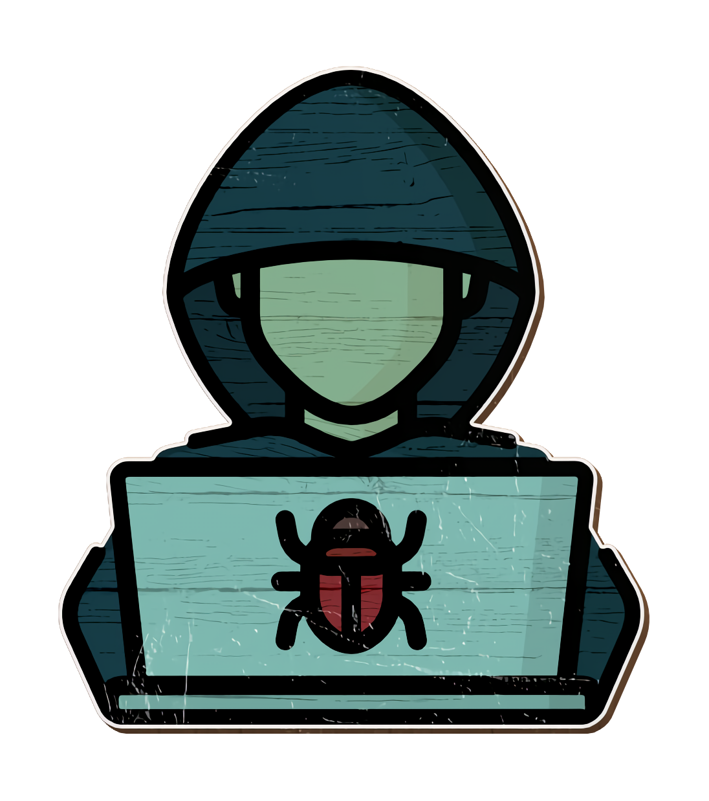

<h1 align="center">
  Project Pass.in
  
</h1>

<h2>
    About:
</h2>

- Project carried out during Rocketseat's NLW Unite, where we will build a participant management application for in-person events.
- The tool allows the organizer to register an event and open a public registration page.
- Registered participants can issue a credential for check-in on the day of the event.
- The system will scan the participant's credentials to allow entry to the event.

<h2>
    API documentation(Swagger):
</h2>

- For API documentation, visit the link: https://nlw-unite-nodejs.onrender.com/docs
___________________________________________________________________________________________________

 
 

<h1 align="center">
    Technologies involved
</h1>

 
 

<!-- 

    

 
  -->

<!-- 

    

 -->

    

        
        
        
    

    

 
 

    <h1 align="center">
        Software used
    </h1>

 
 

    

        
    

