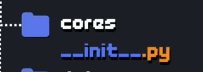

Vantagens de se programar

  - Resolva problemas mais rápido
  - Seja mais criativo
  - Espírito de comunidade(trabalhar em conjunto, compartilhar...)
  - Aprender as coisas mais rápido

Maiores obstáculos
  - Falta de compromisso
  - Excesso de pressa
  - Poucos exercícios práticos
  - Não valorizar a base
  - Achar que já sabe tudo

- É difícil?
  - Não. Programar não é fácil, mas está longe de ser impossível/difícil

"O exercício e a prática da humildade é de extrema importância 
para o bom profissional"

- Principais profissionais
  - Desktop
  - Web
  - Mobile
  - IoT
  - Games

----------------------------------------------------------------

O Python
  - De onde vem o python?
    - 1982 | Amsterdam - Holanda
    - CWY -> Centro de matemática e ciência da computação
    - Guido Van Hossum
      - Década de 80 trabalhava no projeto da linguagem ABC
  
      - 1989
      - Ao encontrar problemas para adaptar um programa em linguagem C, ele 
      pensou "Porque não criar uma linguagem para resolver esse problema?"
      - Assim surgiu a proposta que veio se tornar a linguagem python
      - O intuito do von hossum, era criar uma linguagem de programação, que 
      seria interpretada, mas que tivesse comandos simples, que seriam
      fáceis de entender
      - Criar comandos de simples compreensão
      - Com isso veio o desafio... qual o nome da linguagem?
      - E dentro da CWY, existia um pequeno padrão para nomear os 
      projetos internos, tudo que era criado dentro do departamento, era 
      batizado com um nome de um programa ou alguma coisa que remetesse 
      a televisão.
      - Desta forma, Von Hossum batizou o projeto homenageando o seu 
      programa de humor favorito "Monty python FLYING CIRCUS"\
      - Biologicamente, sabemos que existe uma espécie de cobra ou serpente 
      chamada piton, ou do inglês, python.
      - Ao olhar o símbolo da linguagem, podemos perceber que são duas 
      cobras entrelaçadas.
      - Um dos primeiros livros de programação de python, que foi publicado, 
      foi da editora o'reilly e ao buscarmos pelo livro, sabemos que essa 
      editora, sempre utiliza um animal na capa e para python, primeiramente
      foi utilizado a cobra piton e a partir desse livro, a linguagem
      começou a ficar mais famosa e mais aceita dentro do mercado
      - Assim,o Guido se rendeu ou acabou aceitando a cobra piton como 
      um dos representantes da linguagem.
      - A linguagem em si começou a criar 'corpo', uma comunidade que realmente
      gostava 
      - Primeiras versões de python foram lançadas no início da década de 90 e 
      a linguagem começou a ganhar corpo, uma comunidade que gostava da 
      linguagem pela sua simplicidade e facilidade de aprendizado.
      - Sendo assim, o Guido acabou saindo da holanda e vindo para os EUA e 
      começou a ensinar as pessoas a programar, surgindo assim o projeto
      CP4E(Computer Programming for Everybody)
      - Em 2001 com a linguagem ganhando corpo, foi criado uma fundação
        - A python software foundation
        - Uma fundação sem fins lucrativos, que mantém e coordena o python
        - Atualmente a linguagem evolui de acordo com a comunidade
      - Patrocinadores: Microsoft, Google e a Globo.com
        - A própria Globo.com utiliza python em seus principais serviços, 
        principalmente em seus sites e transmissões de vídeos.
        - ambas utilizam python em seus serviços, principalmente no site e 
        transmissão de vídeos
    - Atualmente a linguagem evoluiu tanto que ela hoje, é uma das linguagens 
    padrões que já vem instaladas em um monte de OS.

      - Um dos projetos que já tem referência diretamente, até mesmo no seu próprio
      nome, identificando que utiliza a linguagem python, é o RaspberryPi
      - Ele vem com a possibilidade de rodar um sistema operacional
      - Sua principal forma de programação e educação é a linguagem Python
      - Uma máquina utilizada para meios educacionais 

    - Aonde está Guido Von Hossum?
      - Ele ainda coordena a criação da linguagem python?
      - Participou ativamente da construção da versão 3 do python
      - 2005 se tornou funcionário da google, a trabalhar e aplicar
      o python em uma série de projetos pessoais e dentro do google.
      - 2013 saiu da google e foi para a Dropbox
  

    - Python é uma linguagem de propósito geral
      - Não é uma linguagem focada em determinada coisa
      - basicamente você pode utilizar a linguagem para tudo
      - Não quer dizer que python é a melhor linguagem de se utilizar.
      - Fácil, simples e intuitivo.
      - Multiplataforma
      - Batteries included (vem com a essência já atualizada e instalada)
      - Livre
      - Linguagem organizada
      - Linguagem orientada a objetos
        - tudo dentro do python é um objeto
      - Muitas bibliotecas
        - biblioteca para app de celular, biblioteca para criação de jogos,
      biblioteca para criar tela de sistemas..
      - Python tem sua filosofia própria, que foi criada por um dos
      programadores da linguagem -> Tim Petters
        - Zen of Python
        - 

    - Aonde o python é aplicado?
      - basicamente em todos os lugares
  
    - Python tem algumas especificidades que a tornam muito poderosa
      - Python suporta números muito grandes
        - é preciso fazer cálculos muito grandes 
        - isso ajuda muito na evolução de sistemas de IA
          - Biotecnologia
        - Computação 3D

    - Quem usa python?
      - Zope
        - Gerenciador de conteúdo, feito totalmente em python
      - Django
        - Framework para criação de conteúdo
                    
      
      - Games com python
        - Freats on fire
        - Jewel quest
        - Eve online
        - Civilization IV
        - Battlefield 2

    - NÃO PULAR ETAPAS!!!

- Como o python funciona?
  - verificando versão -> python --version
  - abrir interpretador -> escrever python no terminal
  - python.org
  - import this -> acessando o Python Zen (Zen of Python)

  - Atualizar versão MacOS -> acessar o site, baixar a versão atualizada em 'Downloads' e abrir o pacote baixado.
    - O Pacote vem com interpretador, Idle(ambiente), vem com as 'baterias' incluídas, ou seja, as bibliotecas padrões instaladas

  - Install linux
    - sudo apt-get install python3.6

- Primeiros comandos em Python3
  - todos os comandos são funções
  - toda função tem que ter parênteses
  - função para instruir a escrever algo em tela -> print()
  - para realizar uma soma e mostrar em tela, precisa necessariamente da função print e da informação,
  por exemplo 7 + 4, resultando na seguinte expressão -> print(7+4)
  - Função para interagir com o usuário na inserção de dados -> input
    - nome = input('Qual é o seu nome?') 
    - idade = input('Qual a sua idades?)
    - peso = input('Quanto você pesa?)

    - print('Nome: ' + nome, ' | ' , 'Idade: ' ,idade, ' | ' , 'Peso: ' ,peso)

https://www.youtube.com/watch?v=ElRd0cbXIv4&list=PLvE-ZAFRgX8hnECDn1v9HNTI71veL3oW0&index=6
5 minutos

- Instalando PyCharm no MacOS
  - Acessar https://www.jetbrains.com/pt-br/pycharm/download/#section=mac
  - Baixar arquivo .dmg versão community
  - e fazer processo de instalação

- Instalando PyCharm no Linux
  - acessar https://www.jetbrains.com/pt-br/pycharm/download/#section=linux
  - Baixar arquivo .tar.gz versão community
  - Salvar o arquivo
  - extrair 
  - copiar a pasta e colocar aonde desejar
  - acessar terminal
  - acessar a pasta do community
  - cd bin
  - executar ./pycharm.sh

- Modulo 03 -> Tratando dados e fazendo contas

  - Aula 06 -> Tipos primitivos e Saída de Dados
    - Toda linguagem de programação trabalha basicamente com 4 tipos primitivos, o python em si, 
    tem mais tipos... mas será visto o básico, ou seja, os 4 tipos conhecidos.
      - Tipos primitivos:
        - Int -> Valores inteiros
        - Float -> Valores reais ou ponto flutuante
        - Bool -> Valores booleanos ou lógicos
        - Str -> Caracteres ou Strings

      - Exemplos:
        - Int: 7, -4, 0, 9875
        - Float: 4.5, 0.076, -15.223, 7.0
        - Bool: True e False 
          - Os valores true e false, para os booleanos, devem ser estar com a primeira letra em 
          caixa alta (capitalize)
        - Str: 'Olá', '7.5', ''

    - Uso do print
      - print('A soma vale: ',soma)
      - print('A soma vale: {}'.format(soma))
        - As {} é um tipo de máscara, que vai ser substituído por um método da própria string
        - Podemos ver no exemplo acima, que no lugar do {}, vai aparecer o valor armazenado na var soma

    - Funções
      - isnumeric() -> verifica se o valor é numérico | Ele verifica se é possível converter o valor
      presente em um número com o tipo primitivo int
      - isalpha() -> verifica se o valor é uma letra(literal)
      - isalphanum() -> Verifica se o valor inserido é alpha numérico
      - isupper() -> verifica se o valor inserido esta capitalize

  Aula 07
    - Operações aritméticas
    - Nessa aula, vamos aprender quais são os operadores aritméticos do Python e também sua ordem de precedência dentro de expressões matemáticas. Beja como funcionam os operadores de adição, subtração, multiplicação, 
    divisão, exponenciação e quociente na linguagem Python 

    https://www.cursoemvideo.com/curso/python-3-mundo-1/aulas/tratando-dados-e-fazendo-contas/modulos/operadores-aritmeticos-2/ ->13:04

    Exemplo:
      5 + 2 == 7
      5 - 2 == 3
      5 * 2 == 10
      5 / 2 == 2.5
      5 ** 2 == 25
      5 // 2 == 2 
      5 % 2 == 1

    - Ordem de precedência
      - () (parêntesis)
      - ** {exponenciação}
      - *, /, // , %
      - +, - 

    - Exemplo
      -> 5 + 3 * 2 ==> 5 + 6 ==> 11
      -> 3 * 5 + 4 ** 2 ==> 15 + 16 ==> 31
      -> 3 * ( 5 + 4 ) ** 2 ==> 3 * 9 ** 2 ==> 3 * 81 ==> 243

    - Aula 07 
      - uso do :20 -> ira imprimir o resultado presente na variável em 20 espaços
      - :>20 -> irá imprimir o resultado presente na variável a direita do espaço
      - :<20 -> irá imprimir o resultado presente na variável a esquerda do espaço
      - :^20 -> irá imprimir o resultado presente na variável centralizado de acordo com o espaço

      - para juntar dois prints e não realizar a quebra, é so adicionar no final do primeiro print
      end=' '

      => Aula 08 - Utilizando Módulos
        - dentro da linguagem python, para incluir algo, precisamos utilizar o comando import
        - depois do comando colocamos o nome do módulo ou da biblioteca que será importada
        - importações únicas (específicos)
          - 'from doce import pudim'
        - Importando as funcionalidades de um modulo (generalistas)
          - import 'modulo'

          - Modulo Math 
            - ceil -> arredondamento para cima
            - floor -> arredondamento para baixo
            - trunc -> elimina valores da , para frente
            - pow -> potência, tem funcionalidade semelhante aos dois *
            - sqrt -> raiz quadrada
            - factorial -> calcular o fatorial

      => Aula 09 - Manipulando cadeias de textos
        - Cadeias de caracteres: 
          - Atribuição string em uma variável 
            - frase = 'Curso em Vídeo Python'
            - cada posição da frase por exemplo citada a cima, é posicionada 
            em um 'mini espaço', mesmo os espaços entre as palavras, tem suas 
            posições nesses 'mini espaços' e essas posições recebem indexes, 
            que se iniciam em 0 e vão até o valor de letras necessários, que 
            remete ao tamanho da palavra ou frase que está em questão dentro 
            da memória.
            - Através dessas posições ou indexes existentes nas cadeias de 
            caracteres, podemos efetuar algumas operações nessas cadeias,
            como por exemplo: 
              - Fatiamento: Fatiar uma string, é conseguir pegar pedaços dela
                - frase[9]
                  - [] em python remete a estrutura de lista
                  - Ao colocarmos frase[9], vai ser possível identificar dentro 
                  da cadeia de caracteres, o carácter presente na posição 10
                  - Analisarmos a cadeia de caracteres presente em frase, 
                  podemos perceber que a 10 posição contêm a letra V
                    - Vale ressaltar que em python é muito importante a diferença
                    entra maiúsculas e minúsculas.
                - Outra forma de realizar o fatiamento é assim frase[9:13]
                  - esta forma condiz com a seleção dos caracteres presentes no 
                  intervalo de 9 a 12, o carácter 13 não entra nesta parte, so 
                  entraria, se fosse frase[9:14]
                  - se eu colocasse frase[9:21], seria mostrado todos os ]
                  caracteres da posição 9 ate a 20, pois como comentamos acima
                  sempre é levado em consideração a posição ali marcada - 1
                  - podemos fazer também frase[9:21:2]
                    - Iremos começar no 9, iremos parar no carácter 20, 
                    porém, iremos pular os caracteres de 2 em 2
                  - e ao colocarmos frase[:5], o que acontece?
                    - quando omitimos o valor antes dos :, significa que o 
                    fatiamento irá iniciar do carácter 0
                  - Se caso você quiser fatiar até o final da frase e não sabe 
                  o final da mesma, cabe a colocar da seguinte forma 
                  frase[15:]
                  - frase[9::3] significa que vai do carácter 9, até o final e 
                  ao mesmo tempo pulando de 3 em três caracteres, mostrando
                  o terceiro carácter no ato do 'pulo'.

              - Análise
                - len(frase)
                  - retorna o comprimento da frase, ou seja, como no exemplo 
                  em questão, o comprimento de frase é 20
                - frase.count('o')
                  - se não colocar o valor (), com '', o sistema pensa que 
                  o elemento é uma variável.
                  - efetuar a contagem de quantas letras 'o' tem na frase usada
                  como exemplo
                - frase.count('o', 0, 13)
                  - realizar a contagem do 'o', através do fatiamento da 
                  posição 0 até a 12.
                - frase.find('deo')
                  - mostra aonde iniciou o elemento passado, 
                  como instância e retorna a posição
                - frase.find('Android')
                  - como não existe a palavra Android, dentro de frase, será
                  retornado o valor -1
                - Operador 'in'
                  - 'Curso' in frase
                  - Verificar se existe a palavra Curso em frase
                    - retornando True

              - Transformação
                - frase.replace('Python', 'Android')
                  - será procurado a string Python e substituirá pela palavra 
                  Android
                - frase.upper()
                  - com essa funcionalidade, toda a frase será colocada em 
                  caixa alta, ou seja, tudo maiúsculo.
                - frase.lower()
                  - com essa funcionalidade, toda a frase será colocado em 
                  minúsculo, ou seja, o contrário de upper()
                - frase.capitalize()
                  - ele pega toda a frase e aonde estava em minúsculo será
                  mantido, aonde estava em maiúsculo será aplicado o efeito 
                  lower, menos na primeira letra, ou seja, a primeira ficará
                  em maiúsculo.
                - frase.title()
                  - Essa funcionalidade é semelhante com o capitalize, porém,
                  o title, ele analisa palavra por palavra, através dos 
                  espaços presentes na frase e aplica o upper na primeira letra
                  de cada palavra.  
                - frase.strip()
                  - remove os espaços 'inúteis' no inicio e no fim da frase em 
                  questão.
                - frase.rstrip()
                  - remove somente os espaços presentes no final da frase, 
                  ou seja, do lado direito.
                - frase.lstrip()
                  - remove somente os espaços presentes no inicio da frase, 
                  ou seja, do lado esquerdo.

              - Divisão
                - frase.split()
                  - o split aplica nos espaços existentes uma divisão dentro
                  da própria frase em questão
                  - Ex.: Curso em Vídeo Python
                  - apos a divisão, ou seja, aplicação do split()
                    - Curso, indexação de 0 a 4
                    - em, indexação de 0 a 1
                    - Vídeo, indexação de 0 a 4
                    - Python, indexação de 0 a 5

              - Junção
                - ' '.join(frase)
                  - essa funcionalidade vai aplicar a junção dos elementos 
                  existentes em frase, através do separador ' '.

      => Aula 10 - Condições(Parte 1)
        - Nessa aula, vamos aprender como utilizar estruturas 
        condicionais simples e compostas nos seus programas em Python.
        - condicionais:
            carro.siga()
            se carro.esquerda()
              carro.siga()
              carro.direita()
              carro.siga()
              carro.direita()
              carro.esquerda()
              carro.siga()
              carro.direita()
              carro.siga()
            senao
              carro.siga()
              carro.esquerda()
              carro.siga()
              carro.esquerda()
              carro.siga()
            carro.pare()

        - de uma visão diferente:
          se carro.esquerda()
            bloco _V_ (verdadeiro)
          senao
            bloco _F_ (falso)

        - na visão de condicional em python:
          if carro.esquerda():
            bloco True
          else:
            bloco False

  Aula 11:
  - Padrão ANSI (padrão normalização internacional)
    - Escape sequence
    - tudo dentro de ANSI, começa com \(carácter escape)
    - Para representar uma cor em python, você vai iniciar com \033[ e fechar o 
    código com uma letra m, ficando da seguinte forma: \033[m
    - Entre o [ e o m, vai ser adicionado o código da cor desejada
    - a sequencia de código no espaço mencionado acima é [STYLE;TEXT;BGm
      - Códigos para sequencia de estilo:
        - 0 -> sem estilo nenhum
        - 1 -> Negrito
        - 4 -> Underline
        - 7 -> Inverter as configurações (Negative)

      - Códigos para sequência de cores
        - 30 -> Branco
        - 31 -> Vermelho
        - 32 -> Verde
        - 33 -> Amarelo
        - 34 -> Azul
        - 35 -> Magenta
        - 36 -> Ciano
        - 37 -> Cinza

      - Códigos para Background
        - 40 -> Branco
        - 41 -> Vermelho
        - 42 -> Verde
        - 43 -> Amarelo
        - 44 -> Azul
        - 45 -> Magenta
        - 46 -> Ciano
        - 47 -> Cinza

__________________________________________________________________________________________________________________________________________________________________

Mundo 02 - Curso de Python

Assuntos: 
- Condições 
  - Simples
  - Compostas
  - Aninhadas

- Iterações
  - estruturas de repetição com variável de controle, com teste lógico no inicio
  - Repetições infinitas com interrupção no meio

Aula 012:

  - Condições aninhadas:

    carro.siga()
    if carro.esquerda():
      carro.siga()
      carro.direita()
      carro.siga()
      carro.direita()
      carro.esquerda()
      carro.siga()
      carro.direita()
      carro.siga()
    elif carro.direita():
      carro.siga()
      carro.esquerda()
      carro.siga()
      carro.esquerda()
      carro.siga()
    else:
      carro.siga()
    carro.pare()

tempo 13:11

__________________________________________________________________________________________________________________________________________________________________

Aula 13

- Laços de repetição (parte 1)

  - Uma forma de executar um comando de maneira repetitiva até que obtenha uma ordem ou um pedido para finalizar ou realizar outra ação.

  - portugues:
    - laço c no intervalor(1,10)
      - passo
    - pega

  - python
    - for c in ranget(1,10):
      - passo
    - pega

  - para realziar a contagem de valores através de um for, por exemplo de 1 ate 5:
    - for c in ranget(1,6):
      - print(c)
    - print('FIM')

  - para contar de maneira contrária, basta adicionar um -1 na iteração
    - for c in ranget(1, 10, -1):
      - print(c)
    - print('FIM')

  - calculo de n-ésimo termo de uma PA
    - nTermo = firstTerm + (n-1) * razao

  - adicionando termo na listagem:
    - lista.append(i)

__________________________________________________________________________________________________________________________________________________________________

Aula 14

- diferença de um for para um while:
  - no for nós sabemos o limite ou ate quando temos que ir com o laço de repetição
    - conhecida também como estrutura de repetição com variável de controle
  - while nos sabemos o nosso objetivo como no exemplo do for, porém, não sabemos quantos passos ou quanto teremos que fazer para alcançar o mesmo 
    - é conhecida também como estrutura de repetição com teste lógico
    - no while temos também a questão da flag ou condição de parada, que é quando usamos uma condição para realizar uma parada 

    TEMPO: 28:27

___________________________________________________________________________________________________

Aula 15

 - pontos principais da aula: Break e loopings infinitos
 - apartir da versão 3.6 do python, mais especificamente na 3.6.3, foi feita uma PEP (Python Enhancement Proposal), uma proposta de melhoria do python e a PEP 498, se trata de uma forma de escrever em python chamada Fstrings. Segue um exemplo: 

print('A soma vale {}'.format(var)) -> maneira vista no curso ate o momento

#usando fstrings
print(f'A soma vale {}') -> é adicionado um f antes de começar a parte de strings do print e quando usamos as fstrings, é começado a usar uma técnica chamada interpolação dentro de strings... e o resultado seria esse:

print(f'A soma vale {soma}') -> assim já mostraria a resposta completa

___________________________________________________________________________________________________

Aula 22 => Módulos e Pacotes

 - Modularização: ato de construir módulos
   - Surgiu no início da década de 60
   - Sistemas estavam ficando cada vez maiores
     - Por isso surgiu ou foi criado o termo modularização, ou seja, 
     quebrar um programa/projeto que estava assumindo um tamanho
     considero grandioso, em pequenas partes, para que possa ficar mais fácil
     de entender a funcionalidade, as etapas e o que o programa vai estar 
     resolvendo.
   - Foco: 
     - Dividir um programa muito grande
     - Aumentar a legibilidade
     - Facilitar a manutenção do sistema ou do projeto

   - Vantagens:
     - Organização do código -> ao modularizar, dividimos um problema grande, em partes menores 
     - Facilidade na manuntenção -> Caso alguma parte do código parar de funcionar ou se for preciso
     atualizar alguma função criada dentro do arquivo de modularização, essa ação será bem mais fácil
     de realizar
     - Ocultação de código detalhado -> não é necessário saber com se calcula um fatorial, só preciso
     saber que dentro do meu arquivo de modularização, existe uma função chamada fatorial()
     - Reutilização em outros projetos -> é só realizar a cópia do arquivo de modularização e colocar
     na pasta do outro projeto

       
 - Pacotes: em algumas outras linguagens fica conhecido como biblioteca
  -  Junção de vários módulos e separados por assunto, ou seja, a grosso modo, uma pasta que contém módulos 
  - como criar um pacote em python?
    - basta criar dentro do  projeto uma pasta com o nome determinado pelo usuário
    - para criar os determinados módulos a serem utilizados, basta criar dentro da pasta  
    criada acima pelo usuário, outra pasta com o nome do determinado módulo
    - Obs.: nem sempre vai ser utilizado pacotes nos projetos, pacotes em si, são para quando 
    os projetos ficarem muito grande
    - Existe uma sintaxe para nome de arquivos  dentro de pacotes, inclusive um arquivo especial,
    que podeser colocado dentro de cada pasta criada dentro do seu pacote
      - a sintaxe é:  
      

___________________________________________________________________________________________________

## Aula 23 - Erros, exceções e tratamentos

 - ERROS ACONTECEM!
 - Exemplo:
   - print(x)
     - resultaria em um erro, pois a variável x não foi inicializada
     - Na verdade não é um erro e sim uma exceção chamada NameError
     
   - n = int(input('Número: '))
     - Se um user colocar 'oito', irá gerar uma exceção, pois, o valor
    aguardado é um numeral e não uma string
     - E isso resultará na exceção ValueError
     
   - r = a / b
     - neste caso um exemplo de exceção é a divisão por 0(no caso se 
     b assumir um valor 0 ou for inserido via teclado)
     - E isso resultará na exceção ZeroDivisionError
     
   - r = 2/'2'
     - Resultará em um TypeError
     - pois o segundo 2 não é um número e sim uma string
 
   - lst = [3,6,4]
     - print(lst[3])
     - vai resultar em erro, pois a posição 3 não existe
     - E isso resultará na exceção IndexError ou no caso 
     dos dicionários, seria uma KeyError
     
   - import uteis
     - se caso uteis não existir, vai resultar na exceção
     ModuleNotFoundError
   - Mais exemplos:
     - NameError
     - ValueError
     - ZeroDivisionError
     - TypeError
     - IndexError
     - KeyError
     - EOFError
     - KeyboardInterrupt
     - OSError
     - MemoryError
     - ConnectionError
     - RuntimeError

    - Listagem de exceções: 
       https://docs.python.org/3/library/exceptions.html

    - estrutura try/except
      - no try é o que geralmente pode dar problema, qual o comando ou os 
      comandos que dariam problemas
        - Um mesmo try pode ter vários excepts
      - except é conhecido como a área da falha, se caso o que estiver
      no try falhar, o que será apresentado?
      - else é pra quando o resultado da operação no try funcionar 
      - finally: vai acontecer independete se deu certo ou se deu errado
      - OBS.: tanto o else quanto finally são opcionais
      

